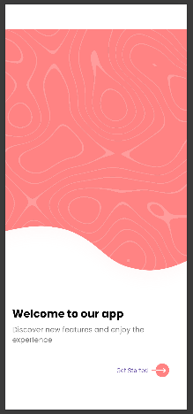
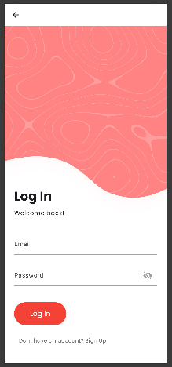

# ui_design_practice

A Flutter UI design practice project featuring a welcome page, login page, and signup page. This is a basic UI project completed within a few hours.

## Getting Started

This repository contains a Flutter application focused on UI design practice. Follow the installation steps below to run the app locally.

## Installation

### Prerequisites
- Flutter SDK installed. [Install Flutter](https://docs.flutter.dev/get-started/install)
- Git installed on your system
- A connected device or simulator/emulator

### Steps

1. **Clone the repository:**

   ```bash
   git clone https://github.com/jawadhossainmahi/flutter_ui_design_practice.git
   cd flutter_ui_design_practice
   ```

2. **Get the project dependencies:**

   ```bash
   flutter pub get
   ```

3. **Run the app on a connected device or simulator:**

   ```bash
   flutter run
   ```

## Project Structure

- `lib/` - Flutter source code for the app UI
- `assets/` - Images and other resources used in the app
- `pubspec.yaml` - Project metadata and dependency configuration

## Screenshots

Below are sample screenshots showing the app UI design:

| Welcome Screen | Login Screen | Signup Screen |
|---|---|---|
|  |  |  |

## Resources

- [Learn Flutter](https://docs.flutter.dev/get-started/learn-flutter)
- [Write your first Flutter app](https://docs.flutter.dev/get-started/codelab)
- [Flutter learning resources](https://docs.flutter.dev/reference/learning-resources)

For help getting started with Flutter development, view the [online documentation](https://docs.flutter.dev/), which offers tutorials, samples, guidance on mobile development, and a full API reference.
